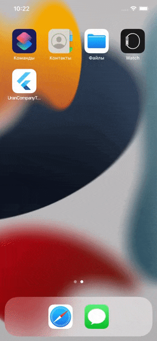

# uran_company_test_task
A test task for UranCompany from Yevhen Tymchenko

**App description:**
A simple application to display a list of retrieved items from the Internet. The main page has two states, loaded data and failed loading.

**Used libraries:**
- freezed
- flutter_bloc
- retrofit
- json_serializable

**Spent time: 3 hrs total**

**Preview (success loading)**

**Preview (failed loading)**

